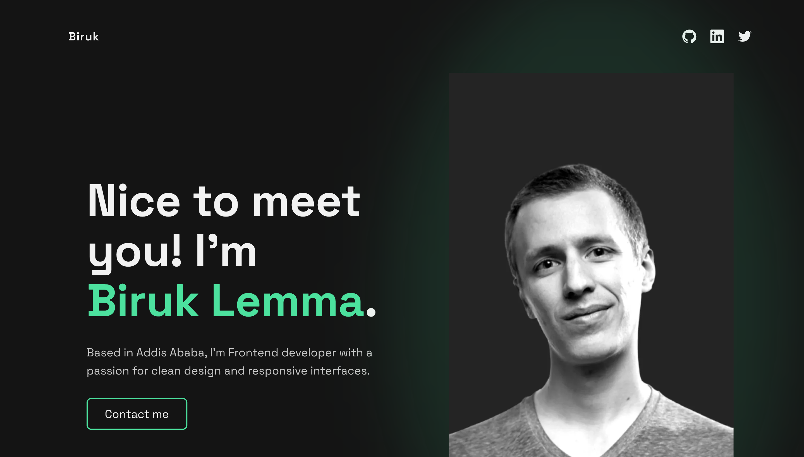

# Single-Page Developer Portfolio

A modern, minimal, and atmospheric developer portfolio designed to showcase projects, skills, and contact information on a single page. Built with semantic HTML, responsive CSS, and subtle micro-interactions for a premium visual feel.

This project is based on the **Frontend Mentor - Single-page developer portfolio** challenge, then transformed into a personalized and branded version with:
- Neon accent identity color
- Hero portrait glow effect
- Ambient background aura
- Editorial-style section headings
- Consistent hover and focus interactions

---

## ✨ Features

- **Single Page Layout** — clean, simple, and easy to navigate  
- **Fully Responsive** — optimized for mobile, tablet, and desktop  
- **Custom Branding** — neon green accent + ambient glow identity style  
- **Smooth Micro-Interactions** — hover states & floating glow animation  
- **Accessible by Design** — keyboard navigable, readable contrast, focus states  
- **No Frameworks Needed** — just HTML, CSS, and small, optional vanilla JS  

---

## 🖼 Preview

  

Live Demo: **(Add your GitHub Pages or custom domain link here)**  

---

## 🧱 Built With

| Technology | Purpose |
|-----------|---------|
| HTML5 | Structure & semantics |
| CSS3 (Custom Properties + Grid + Flexbox) | Styling, layout, responsiveness |
| Vanilla JavaScript | Micro-interactions & glow scroll effect |
| VS Code / Any Editor | Development |

No frameworks. No UI libraries. No bundlers.

---

## 📂 Project Structure

├── assets
│ ├── icons
│ └── images
├── css
│ ├── base.css # Reset defaults
│ ├── main.css # Layout, hero glow, sections, responsive styles
│ └── variables.css # Accent color, spacing scale, typography tokens
├── js
│ └── main.js # Ambient glow fade-in & scroll micro-motion
├── index.html
└── Preview.png

---

## ✅ License

This project is open source and free to use.  

---

## 🙌 Acknowledgements

Challenge from **Frontend Mentor**  
Custom enhancements, glow system, and interaction direction by **Biruk Lemma**

